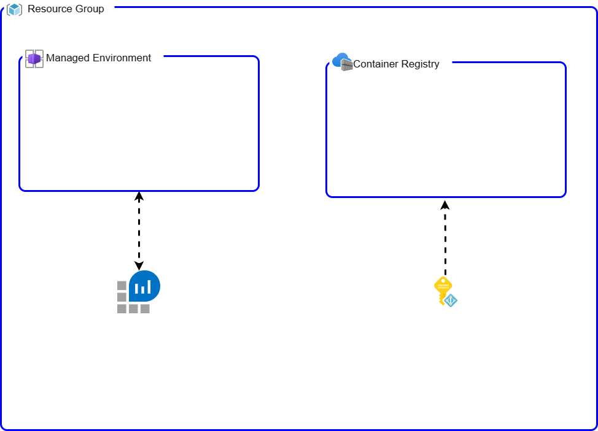

# Docusaurus-aca-yaml (Docusaurus in Azure Container App using yaml deployment)

This repository includes a simple Docusaurus Site with a basic template for hosting product documentation. The repository is a helper for exploring different `DevOps` options for Container Apps cse-devblog

This flow takes advantage of the `YAML` option during a containerapp create/update/revision copy [link](https://aka.ms/azure-container-apps-yaml)

## Bootstrap Infrastructure

Validate you are connected to an Azure subscription and update `infra/sample.main.parameters.json` to `infra/main.parameters.json` with your details.

```bash
make bootstrap
```

For this flow, the infrastructure bootstrapped looks like this:



## Deploy application

For the demo, we will be orchestrating the deployment locally. In other words, we will be running the pipeline commands locally.

1. Build the container

    After running the bootstrap, in this step we will be creating the docker container and pushing it into the bootstrapped ACR.

    ```bash
    make ci-package
    ```

2. Update the deployment yaml

    In this step we will be generating a deployment config. As you can see, dev team will require to have knowledge about the infra and requirements for the containerapp. This is one of the `cons` of this flow.

    ```bash
    make prepare-template
    ```

    You can find the template that will be used for deployment under `ci/deployment.yaml`.

3. use `az cli` to deploy/create the containerapp

    ```make
    make deploy
    ```

## Summary

### Pros

- separates completely role of operations team and dev team
- devs have full control of the container app

### Cons

- dev team requires to have knowledge about the configuration for the
- there isn't an official schema for the yaml deployment
